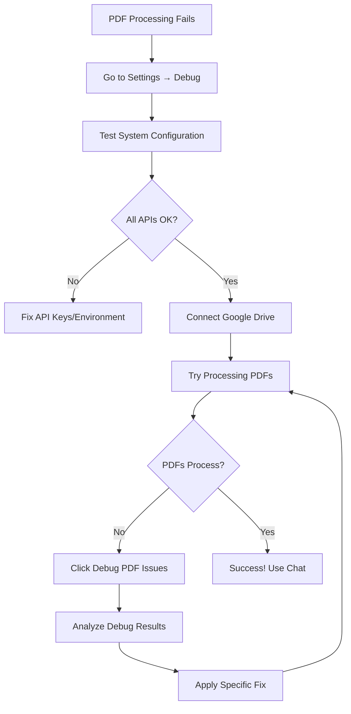

# 🔧 PDF Processing Troubleshooting Guide

## 🎯 Quick Fix for "0 PDFs processed" Error

### **Problem:** "Could not extract text from any PDF files"

This error occurs when the PDF text extraction pipeline fails. Here's how to diagnose and fix it:

## 📋 **Step-by-Step Troubleshooting**

### **Step 1: Check System Configuration**
1. Go to **Settings** → **Debug** tab
2. Click **"Test System Configuration"** 
3. Verify all items show ✅ green status:
   - OpenAI API Key: OK
   - Google Client ID: OK 
   - Google Drive Client ID: OK
   - Overall Config: OK

**If any show ❌ red:**
- Check your `.env` file contains all required variables with `VITE_` prefix
- Verify API keys are valid and not expired
- Restart the development server after updating .env

### **Step 2: Test PDF Processing**
1. Connect Google Drive successfully 
2. Select a folder with PDF files
3. If all PDFs fail, click **"Debug PDF Issues"** button
4. Run the debug test to see detailed failure information

### **Step 3: Analyze Debug Results**
The debugger will show exactly where the process fails:

#### **Common Issues & Solutions:**

**🔸 Network/API Issues:**
```
Error: Failed to download PDF from Google Drive
```
- **Fix**: Check internet connection, verify Google Drive API access

**🔸 PDF Content Issues:**
```
Error: Extracted content quality insufficient
```
- **Fix**: Try PDFs with selectable text (not scanned images)
- **Fix**: Ensure PDFs are not password protected

**🔸 Supabase Function Issues:**
```
Error: Function invocation failed
```
- **Fix**: Check Supabase function deployment
- **Fix**: Verify environment variables in Supabase dashboard

**🔸 OpenAI API Issues:**
```
Error: OpenAI API request failed
```
- **Fix**: Check API key validity and credits
- **Fix**: Verify network access to OpenAI services

## 🚀 **Enhanced Features Added**

### **Robust PDF Processing:**
- ✅ **3 retry attempts** per PDF with exponential backoff
- ✅ **Multiple extraction methods**: streams, text objects, text blocks, ASCII fallback
- ✅ **Content validation**: Ensures meaningful text is extracted
- ✅ **Progress tracking**: Real-time updates for large batches
- ✅ **Quality assessment**: Good/Moderate/Limited quality indicators

### **Advanced Debugging:**
- ✅ **System diagnostics**: Test all API connections
- ✅ **PDF-specific debugging**: Test individual file processing
- ✅ **Detailed logging**: See exactly what's happening at each step
- ✅ **Error categorization**: Identify specific failure points

### **Zero Hallucination Chat:**
- ✅ **PDF-only responses**: Answers strictly from uploaded content
- ✅ **Source attribution**: Every answer cites specific PDF sources
- ✅ **Content validation**: Ensures chat has relevant PDF content
- ✅ **Advanced search**: Finds content across all processed PDFs

## 🔍 **Debugging Workflow**



## 📝 **Environment Variables Checklist**

Ensure your `.env` file contains:

```env
# Required for PDF processing
VITE_OPENAI_API_KEY=sk-your-key-here
VITE_GOOGLE_DRIVE_CLIENT_ID=your-client-id
VITE_GOOGLE_DRIVE_CLIENT_SECRET=your-secret
VITE_GOOGLE_DRIVE_REDIRECT_URI=https://your-supabase.supabase.co/functions/v1/google-drive-auth
VITE_POSTGRES_URL=postgresql://your-db-url
```

## 🎯 **Success Indicators**

When working correctly, you should see:
- ✅ "PDF Successfully Processed" messages
- ✅ Character counts and quality indicators
- ✅ PDFs appear in chat interface
- ✅ Chat responses include source citations
- ✅ Knowledge graph shows PDF connections

## 🆘 **Still Having Issues?**

1. **Check browser console** for JavaScript errors
2. **Verify PDF files** are text-based (not scanned images)
3. **Try different PDF files** to isolate the issue
4. **Restart development server** after configuration changes
5. **Clear browser cache** to ensure fresh API calls

## 💡 **Pro Tips**

- **Use readable PDFs**: PDFs with selectable text work best
- **Avoid large files**: Start with smaller PDFs (< 10MB) for testing
- **Check file permissions**: Ensure PDFs aren't password protected
- **Monitor token usage**: Large datasets may hit API limits
- **Use debug mode**: Always test with debug tools when troubleshooting

---

**Need more help?** The enhanced debugging tools provide detailed logs and specific error messages to help identify the exact issue. Use the "Test System Configuration" and "Debug PDF Issues" tools for comprehensive diagnostics.